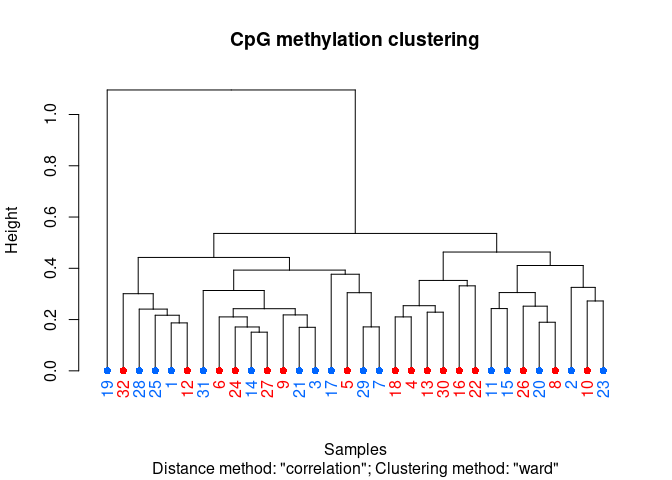
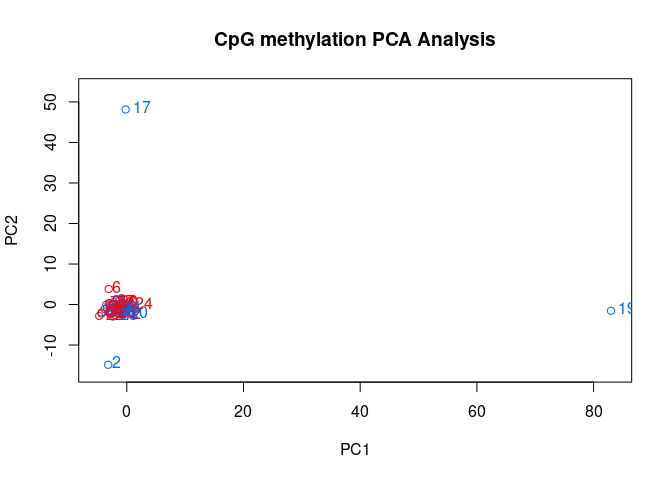
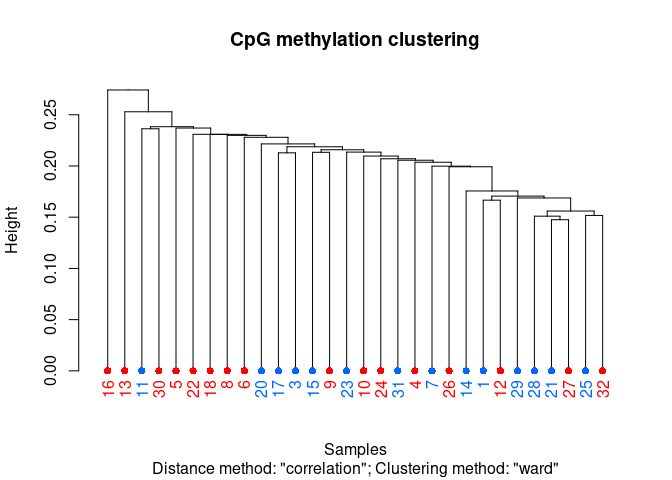
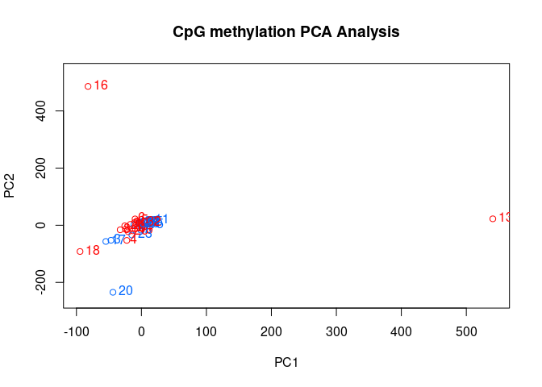
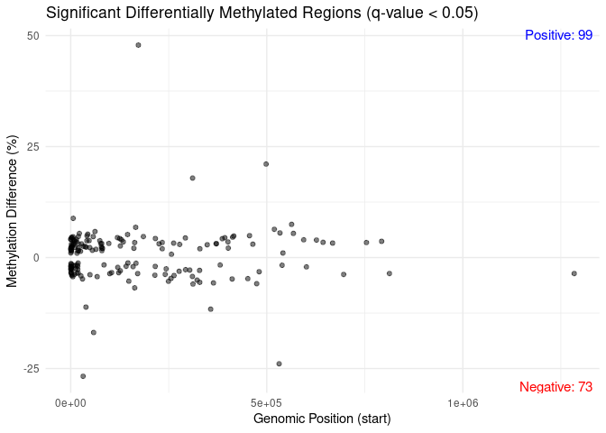

DML using methylkit
================
Zoe Dellaert
10/02/2024

I am identifying differentially methylated loci using methylkit based on
[Yaamini Venkataraman’s code](https://osf.io/u46xj)

# Prepare R Markdown file

# Install packages to run methylkit

``` r
#Packages for running methylKit

if (!require("BiocManager", quietly = TRUE))
    install.packages("BiocManager")

#BiocManager::install("methylKit")
require(methylKit)
```

    ## Loading required package: methylKit

    ## Loading required package: GenomicRanges

    ## Loading required package: stats4

    ## Loading required package: BiocGenerics

    ## 
    ## Attaching package: 'BiocGenerics'

    ## The following objects are masked from 'package:stats':
    ## 
    ##     IQR, mad, sd, var, xtabs

    ## The following objects are masked from 'package:base':
    ## 
    ##     anyDuplicated, aperm, append, as.data.frame, basename, cbind,
    ##     colnames, dirname, do.call, duplicated, eval, evalq, Filter, Find,
    ##     get, grep, grepl, intersect, is.unsorted, lapply, Map, mapply,
    ##     match, mget, order, paste, pmax, pmax.int, pmin, pmin.int,
    ##     Position, rank, rbind, Reduce, rownames, sapply, setdiff, table,
    ##     tapply, union, unique, unsplit, which.max, which.min

    ## Loading required package: S4Vectors

    ## 
    ## Attaching package: 'S4Vectors'

    ## The following object is masked from 'package:utils':
    ## 
    ##     findMatches

    ## The following objects are masked from 'package:base':
    ## 
    ##     expand.grid, I, unname

    ## Loading required package: IRanges

    ## Loading required package: GenomeInfoDb

``` r
#install.packages("tidyverse")
require(tidyverse)
```

    ## Loading required package: tidyverse

    ## ── Attaching core tidyverse packages ──────────────────────── tidyverse 2.0.0 ──
    ## ✔ dplyr     1.1.4     ✔ readr     2.1.5
    ## ✔ forcats   1.0.0     ✔ stringr   1.5.1
    ## ✔ ggplot2   3.5.1     ✔ tibble    3.2.1
    ## ✔ lubridate 1.9.3     ✔ tidyr     1.3.1
    ## ✔ purrr     1.0.2     
    ## ── Conflicts ────────────────────────────────────────── tidyverse_conflicts() ──
    ## ✖ lubridate::%within%() masks IRanges::%within%()
    ## ✖ dplyr::collapse()     masks IRanges::collapse()
    ## ✖ dplyr::combine()      masks BiocGenerics::combine()
    ## ✖ dplyr::desc()         masks IRanges::desc()
    ## ✖ tidyr::expand()       masks S4Vectors::expand()
    ## ✖ dplyr::filter()       masks stats::filter()
    ## ✖ dplyr::first()        masks S4Vectors::first()
    ## ✖ dplyr::lag()          masks stats::lag()
    ## ✖ ggplot2::Position()   masks BiocGenerics::Position(), base::Position()
    ## ✖ purrr::reduce()       masks GenomicRanges::reduce(), IRanges::reduce()
    ## ✖ dplyr::rename()       masks S4Vectors::rename()
    ## ✖ lubridate::second()   masks S4Vectors::second()
    ## ✖ lubridate::second<-() masks S4Vectors::second<-()
    ## ✖ dplyr::select()       masks methylKit::select()
    ## ✖ dplyr::slice()        masks IRanges::slice()
    ## ✖ tidyr::unite()        masks methylKit::unite()
    ## ℹ Use the conflicted package (<http://conflicted.r-lib.org/>) to force all conflicts to become errors

``` r
#Packages for visualization

#install.packages("vegan")
#install.packages("gplots")
#install.packages("dichromat")

require(vegan)
```

    ## Loading required package: vegan

    ## Loading required package: permute

    ## Loading required package: lattice

    ## This is vegan 2.6-8

``` r
require(gplots)
```

    ## Loading required package: gplots

    ## 
    ## Attaching package: 'gplots'

    ## The following object is masked from 'package:IRanges':
    ## 
    ##     space

    ## The following object is masked from 'package:S4Vectors':
    ## 
    ##     space

    ## The following object is masked from 'package:stats':
    ## 
    ##     lowess

``` r
require(dichromat)
```

    ## Loading required package: dichromat

``` r
require(readr)
```

# Obtain session information

``` r
sessionInfo()
```

    ## R version 4.4.0 (2024-04-24)
    ## Platform: x86_64-pc-linux-gnu
    ## Running under: Ubuntu 22.04.3 LTS
    ## 
    ## Matrix products: default
    ## BLAS:   /usr/lib/x86_64-linux-gnu/openblas-pthread/libblas.so.3 
    ## LAPACK: /usr/lib/x86_64-linux-gnu/openblas-pthread/libopenblasp-r0.3.20.so;  LAPACK version 3.10.0
    ## 
    ## locale:
    ##  [1] LC_CTYPE=en_US.UTF-8       LC_NUMERIC=C              
    ##  [3] LC_TIME=en_US.UTF-8        LC_COLLATE=en_US.UTF-8    
    ##  [5] LC_MONETARY=en_US.UTF-8    LC_MESSAGES=en_US.UTF-8   
    ##  [7] LC_PAPER=en_US.UTF-8       LC_NAME=C                 
    ##  [9] LC_ADDRESS=C               LC_TELEPHONE=C            
    ## [11] LC_MEASUREMENT=en_US.UTF-8 LC_IDENTIFICATION=C       
    ## 
    ## time zone: Etc/UTC
    ## tzcode source: system (glibc)
    ## 
    ## attached base packages:
    ## [1] stats4    stats     graphics  grDevices utils     datasets  methods  
    ## [8] base     
    ## 
    ## other attached packages:
    ##  [1] dichromat_2.0-0.1    gplots_3.1.3.1       vegan_2.6-8         
    ##  [4] lattice_0.22-6       permute_0.9-7        lubridate_1.9.3     
    ##  [7] forcats_1.0.0        stringr_1.5.1        dplyr_1.1.4         
    ## [10] purrr_1.0.2          readr_2.1.5          tidyr_1.3.1         
    ## [13] tibble_3.2.1         ggplot2_3.5.1        tidyverse_2.0.0     
    ## [16] methylKit_1.30.0     GenomicRanges_1.56.1 GenomeInfoDb_1.40.1 
    ## [19] IRanges_2.38.1       S4Vectors_0.42.1     BiocGenerics_0.50.0 
    ## [22] BiocManager_1.30.23 
    ## 
    ## loaded via a namespace (and not attached):
    ##  [1] bitops_1.0-8                rlang_1.1.3                
    ##  [3] magrittr_2.0.3              matrixStats_1.4.1          
    ##  [5] compiler_4.4.0              mgcv_1.9-1                 
    ##  [7] vctrs_0.6.5                 reshape2_1.4.4             
    ##  [9] pkgconfig_2.0.3             crayon_1.5.2               
    ## [11] fastmap_1.1.1               XVector_0.44.0             
    ## [13] caTools_1.18.3              utf8_1.2.4                 
    ## [15] Rsamtools_2.20.0            rmarkdown_2.26             
    ## [17] tzdb_0.4.0                  UCSC.utils_1.0.0           
    ## [19] xfun_0.43                   zlibbioc_1.50.0            
    ## [21] jsonlite_1.8.8              DelayedArray_0.30.1        
    ## [23] BiocParallel_1.38.0         parallel_4.4.0             
    ## [25] cluster_2.1.6               R6_2.5.1                   
    ## [27] stringi_1.8.4               limma_3.60.5               
    ## [29] rtracklayer_1.64.0          numDeriv_2016.8-1.1        
    ## [31] Rcpp_1.0.12                 SummarizedExperiment_1.34.0
    ## [33] knitr_1.46                  R.utils_2.12.3             
    ## [35] Matrix_1.7-0                splines_4.4.0              
    ## [37] timechange_0.3.0            tidyselect_1.2.1           
    ## [39] qvalue_2.36.0               rstudioapi_0.16.0          
    ## [41] abind_1.4-5                 yaml_2.3.8                 
    ## [43] codetools_0.2-20            curl_5.2.1                 
    ## [45] plyr_1.8.9                  Biobase_2.64.0             
    ## [47] withr_3.0.0                 coda_0.19-4.1              
    ## [49] evaluate_0.23               mclust_6.1.1               
    ## [51] Biostrings_2.72.1           pillar_1.9.0               
    ## [53] MatrixGenerics_1.16.0       KernSmooth_2.23-22         
    ## [55] generics_0.1.3              RCurl_1.98-1.16            
    ## [57] emdbook_1.3.13              hms_1.1.3                  
    ## [59] munsell_0.5.1               scales_1.3.0               
    ## [61] gtools_3.9.5                glue_1.7.0                 
    ## [63] tools_4.4.0                 BiocIO_1.14.0              
    ## [65] data.table_1.15.4           GenomicAlignments_1.40.0   
    ## [67] mvtnorm_1.2-4               XML_3.99-0.16.1            
    ## [69] grid_4.4.0                  bbmle_1.0.25.1             
    ## [71] bdsmatrix_1.3-7             colorspace_2.1-0           
    ## [73] nlme_3.1-164                GenomeInfoDbData_1.2.12    
    ## [75] restfulr_0.0.15             cli_3.6.2                  
    ## [77] fastseg_1.50.0              fansi_1.0.6                
    ## [79] S4Arrays_1.4.1              gtable_0.3.5               
    ## [81] R.methodsS3_1.8.2           digest_0.6.35              
    ## [83] SparseArray_1.4.8           rjson_0.2.23               
    ## [85] htmltools_0.5.8.1           R.oo_1.26.0                
    ## [87] lifecycle_1.0.4             httr_1.4.7                 
    ## [89] statmod_1.5.0               MASS_7.3-60.2

# load in files from bismark

``` r
analysisFiles <- as.list(list.files("../output/05-methylKit/merged_cpg", full.names=T)) #Put all .cov files into a list for analysis.

head(analysisFiles)
```

    ## [[1]]
    ## [1] "../output/05-methylKit/merged_cpg/1.CpG_report.merged_CpG_evidence.cov.gz"
    ## 
    ## [[2]]
    ## [1] "../output/05-methylKit/merged_cpg/10.CpG_report.merged_CpG_evidence.cov.gz"
    ## 
    ## [[3]]
    ## [1] "../output/05-methylKit/merged_cpg/11.CpG_report.merged_CpG_evidence.cov.gz"
    ## 
    ## [[4]]
    ## [1] "../output/05-methylKit/merged_cpg/12.CpG_report.merged_CpG_evidence.cov.gz"
    ## 
    ## [[5]]
    ## [1] "../output/05-methylKit/merged_cpg/13.CpG_report.merged_CpG_evidence.cov.gz"
    ## 
    ## [[6]]
    ## [1] "../output/05-methylKit/merged_cpg/14.CpG_report.merged_CpG_evidence.cov.gz"

``` r
metadata_WGBS <- read_csv("../data/metadata.WGBS.csv")
```

    ## Rows: 32 Columns: 4
    ## ── Column specification ────────────────────────────────────────────────────────
    ## Delimiter: ","
    ## chr (2): fragment.ID, treatment
    ## dbl (2): block, Sample.ID
    ## 
    ## ℹ Use `spec()` to retrieve the full column specification for this data.
    ## ℹ Specify the column types or set `show_col_types = FALSE` to quiet this message.

``` r
# Extract numbers from bam_list filenames
file_numbers <- gsub("^.*\\/([0-9]+)\\.CpG_report.*$", "\\1", analysisFiles)
file_numbers
```

    ##  [1] "1"  "10" "11" "12" "13" "14" "15" "16" "17" "18" "19" "2"  "20" "21" "22"
    ## [16] "23" "24" "25" "26" "27" "28" "29" "3"  "30" "31" "32" "4"  "5"  "6"  "7" 
    ## [31] "8"  "9"

``` r
# Create a new dataframe with bam numbers and corresponding sample information
merged_data <- data.frame(File_Number = as.numeric(file_numbers))

# Add Sample.ID from the CSV based on matching Bam_Number to Sample.ID
merged_data$fragment.ID <- metadata_WGBS$fragment.ID[match(merged_data$File_Number, metadata_WGBS$Sample.ID)]

merged_data$treatment <- metadata_WGBS$treatment[match(merged_data$File_Number, metadata_WGBS$Sample.ID)]

# Convert treatment values: 1 for "enriched", 0 for "control"
merged_data$treatment <- ifelse(merged_data$treatment == "enriched", 1, 
                                 ifelse(merged_data$treatment == "control", 0, NA))

# Display the updated merged_data
head(merged_data)
```

    ##   File_Number fragment.ID treatment
    ## 1           1        PV_3         1
    ## 2          10       PV_24         0
    ## 3          11       PV_10         1
    ## 4          12       PV_27         0
    ## 5          13       PV_22         0
    ## 6          14       PV_11         1

I’ll use `methRead` to create a methylation object from the coverage
files, and include sample ID and treatment information.

``` r
processedFiles <- methylKit::methRead(analysisFiles,
                                      sample.id = as.list(file_numbers),
                                      assembly = "Pver",
                                      treatment = merged_data$treatment,
                                      pipeline = "bismarkCoverage",
                                      mincov = 2) #Process files. Use mincov = 2 to quickly process reads.

### Save the MethylKit object; re-doing the previous step is memory/time intensive, so best to use the saved object moving forward. 

save(processedFiles, file = "../output/05-methylKit/processedFiles.RData") 
```

``` r
load("../output/05-methylKit/processedFiles.RData")

processedFilteredFilesCov5 <- methylKit::filterByCoverage(processedFiles,
                                                          lo.count = 5, lo.perc = NULL,
                                                          high.count = NULL, high.perc = 99.9) %>%
  methylKit::normalizeCoverage(.)

rm(processedFiles)
#Filter coverage information for minimum 5x coverage, and remove PCR duplicates by excluding data in the 99.9th percentile of coverage with hi.perc = 99.9. Normalize coverage between samples to avoid over-sampling reads from one sample during statistical testing
```

``` r
meth_filter=methylKit::unite(processedFilteredFilesCov5)
```

    ## uniting...

``` r
clusterSamples(meth_filter, dist="correlation", method="ward", plot=TRUE)
```

    ## The "ward" method has been renamed to "ward.D"; note new "ward.D2"

<!-- -->

    ## 
    ## Call:
    ## hclust(d = d, method = HCLUST.METHODS[hclust.method])
    ## 
    ## Cluster method   : ward.D 
    ## Distance         : pearson 
    ## Number of objects: 32

``` r
PCASamples(meth_filter)
```

<!-- -->

# Exclude samples 19 and 2

``` r
outliers <- c(19,2)
outliers_pos <- which(merged_data$File_Number %in% c(19,2))
outliers_frags <- merged_data$fragment.ID[which(merged_data$File_Number %in% c(19,2))]

samples_outrm <- setdiff(as.list(file_numbers),outliers)
treatment_outrm <- merged_data$treatment[-outliers_pos]
frags_outrm <- merged_data$fragment.ID[-outliers_pos]

processedFilteredFilesCov5_outrm <- methylKit::reorganize(processedFilteredFilesCov5,
                                               sample.ids = samples_outrm,
                                               treatment = treatment_outrm)
```

``` r
meth_filter_rmout=methylKit::unite(processedFilteredFilesCov5_outrm)
```

    ## uniting...

``` r
clusterSamples(meth_filter_rmout, dist="correlation", method="ward", plot=TRUE)
```

    ## The "ward" method has been renamed to "ward.D"; note new "ward.D2"

<!-- -->

    ## 
    ## Call:
    ## hclust(d = d, method = HCLUST.METHODS[hclust.method])
    ## 
    ## Cluster method   : ward.D 
    ## Distance         : pearson 
    ## Number of objects: 30

``` r
PCASamples(meth_filter_rmout)
```

<!-- -->

# Characterize general methylation

## Sample-specific descriptive statistics

### Specify working directory for output

``` bash
mkdir ../output/05-methylKit/general-stats
```

``` r
nFiles <- 30 #Count number of samples
fileName <- data.frame("nameBase" = rep("../output/05-methylKit/general-stats/percent-CpG-methylation", times = nFiles),
                       "nameBase2" = rep("../output/05-methylKit/general-stats/percent-CpG-coverage", times = nFiles),
                       "fragment.ID" = frags_outrm,
                       "File_Number" = unlist(samples_outrm),
                       "treatment" = treatment_outrm) #Create new dataframe for filenames.
head(fileName) #Confirm dataframe creation
```

    ##                                                       nameBase
    ## 1 ../output/05-methylKit/general-stats/percent-CpG-methylation
    ## 2 ../output/05-methylKit/general-stats/percent-CpG-methylation
    ## 3 ../output/05-methylKit/general-stats/percent-CpG-methylation
    ## 4 ../output/05-methylKit/general-stats/percent-CpG-methylation
    ## 5 ../output/05-methylKit/general-stats/percent-CpG-methylation
    ## 6 ../output/05-methylKit/general-stats/percent-CpG-methylation
    ##                                                   nameBase2 fragment.ID
    ## 1 ../output/05-methylKit/general-stats/percent-CpG-coverage        PV_3
    ## 2 ../output/05-methylKit/general-stats/percent-CpG-coverage       PV_24
    ## 3 ../output/05-methylKit/general-stats/percent-CpG-coverage       PV_10
    ## 4 ../output/05-methylKit/general-stats/percent-CpG-coverage       PV_27
    ## 5 ../output/05-methylKit/general-stats/percent-CpG-coverage       PV_22
    ## 6 ../output/05-methylKit/general-stats/percent-CpG-coverage       PV_11
    ##   File_Number treatment
    ## 1           1         1
    ## 2          10         0
    ## 3          11         1
    ## 4          12         0
    ## 5          13         0
    ## 6          14         1

``` r
fileName$actualFileName1 <- paste(fileName$nameBase, "-Filtered", "-5xCoverage-", fileName$fragment.ID, "_", fileName$treatment,".jpeg", sep = "") #Create a new column for the full filename for filtered + 5x coverage + specific sample's percent CpG methylation plot

fileName$actualFileName2 <- paste(fileName$nameBase2, "-Filtered", "-5xCoverage-", fileName$fragment.ID, "_",fileName$treatment,".jpeg", sep = "") #Create a new column for the full filename for filtered + 5x coverage + specific sample's percent CpG coverage plot

head(fileName) #Confirm column creation
```

    ##                                                       nameBase
    ## 1 ../output/05-methylKit/general-stats/percent-CpG-methylation
    ## 2 ../output/05-methylKit/general-stats/percent-CpG-methylation
    ## 3 ../output/05-methylKit/general-stats/percent-CpG-methylation
    ## 4 ../output/05-methylKit/general-stats/percent-CpG-methylation
    ## 5 ../output/05-methylKit/general-stats/percent-CpG-methylation
    ## 6 ../output/05-methylKit/general-stats/percent-CpG-methylation
    ##                                                   nameBase2 fragment.ID
    ## 1 ../output/05-methylKit/general-stats/percent-CpG-coverage        PV_3
    ## 2 ../output/05-methylKit/general-stats/percent-CpG-coverage       PV_24
    ## 3 ../output/05-methylKit/general-stats/percent-CpG-coverage       PV_10
    ## 4 ../output/05-methylKit/general-stats/percent-CpG-coverage       PV_27
    ## 5 ../output/05-methylKit/general-stats/percent-CpG-coverage       PV_22
    ## 6 ../output/05-methylKit/general-stats/percent-CpG-coverage       PV_11
    ##   File_Number treatment
    ## 1           1         1
    ## 2          10         0
    ## 3          11         1
    ## 4          12         0
    ## 5          13         0
    ## 6          14         1
    ##                                                                                 actualFileName1
    ## 1  ../output/05-methylKit/general-stats/percent-CpG-methylation-Filtered-5xCoverage-PV_3_1.jpeg
    ## 2 ../output/05-methylKit/general-stats/percent-CpG-methylation-Filtered-5xCoverage-PV_24_0.jpeg
    ## 3 ../output/05-methylKit/general-stats/percent-CpG-methylation-Filtered-5xCoverage-PV_10_1.jpeg
    ## 4 ../output/05-methylKit/general-stats/percent-CpG-methylation-Filtered-5xCoverage-PV_27_0.jpeg
    ## 5 ../output/05-methylKit/general-stats/percent-CpG-methylation-Filtered-5xCoverage-PV_22_0.jpeg
    ## 6 ../output/05-methylKit/general-stats/percent-CpG-methylation-Filtered-5xCoverage-PV_11_1.jpeg
    ##                                                                              actualFileName2
    ## 1  ../output/05-methylKit/general-stats/percent-CpG-coverage-Filtered-5xCoverage-PV_3_1.jpeg
    ## 2 ../output/05-methylKit/general-stats/percent-CpG-coverage-Filtered-5xCoverage-PV_24_0.jpeg
    ## 3 ../output/05-methylKit/general-stats/percent-CpG-coverage-Filtered-5xCoverage-PV_10_1.jpeg
    ## 4 ../output/05-methylKit/general-stats/percent-CpG-coverage-Filtered-5xCoverage-PV_27_0.jpeg
    ## 5 ../output/05-methylKit/general-stats/percent-CpG-coverage-Filtered-5xCoverage-PV_22_0.jpeg
    ## 6 ../output/05-methylKit/general-stats/percent-CpG-coverage-Filtered-5xCoverage-PV_11_1.jpeg

### Create plots

``` r
for(i in 1:nFiles) { #For each data file
  jpeg(filename = fileName$actualFileName1[i], height = 1000, width = 1000) #Save file with designated name
  methylKit::getMethylationStats(processedFilteredFilesCov5_outrm[[i]], plot = TRUE, both.strands = FALSE) #Get %CpG methylation information
  dev.off() #Turn off plotting device
} #Plot and save %CpG methylation information
```

``` r
for(i in 1:nFiles) { #For each data file
  jpeg(filename = fileName$actualFileName2[i], height = 1000, width = 1000) #Save file with designated name
  methylKit::getCoverageStats(processedFilteredFilesCov5_outrm[[i]], plot = TRUE, both.strands = FALSE) #Get CpG coverage information
  dev.off() #Turn off plotting device
} #Plot and save CpG coverage information
```

## Comparative analysis

``` r
methylationInformationFilteredCov5 <- methylKit::unite(processedFilteredFilesCov5_outrm, 
                                                       destrand = FALSE,
                                                       mc.cores = 2) #Combine all processed files into a single table. Use destrand = FALSE to not destrand. By default only bases with data in all samples will be kept
```

    ## uniting...

``` r
head(methylationInformationFilteredCov5) #Confirm unite
```

    ##                          chr start  end strand coverage1 numCs1 numTs1
    ## 1 Pver_Sc0000000_size2095917   926  928      *        34      0     34
    ## 2 Pver_Sc0000000_size2095917  1467 1469      *        57      1     56
    ## 3 Pver_Sc0000000_size2095917  3870 3872      *        67      1     66
    ## 4 Pver_Sc0000000_size2095917  3918 3920      *        50      1     49
    ## 5 Pver_Sc0000000_size2095917  3921 3923      *        46      0     46
    ## 6 Pver_Sc0000000_size2095917  3975 3977      *        43      0     43
    ##   coverage2 numCs2 numTs2 coverage3 numCs3 numTs3 coverage4 numCs4 numTs4
    ## 1        22      2     20        34      0     34        27      1     26
    ## 2        40      0     40        28      0     28        49      0     49
    ## 3        48      0     48        56      2     54        42      1     41
    ## 4        50      2     48        50      0     50        35      3     32
    ## 5        44      0     44        40      0     40        27      1     26
    ## 6        45      2     43        44      0     44        25      0     25
    ##   coverage5 numCs5 numTs5 coverage6 numCs6 numTs6 coverage7 numCs7 numTs7
    ## 1        19      0     19        45      1     44        14      0     14
    ## 2        37      0     37        70      0     70        10      0     10
    ## 3        47      3     44        90      0     90         9      2      7
    ## 4        46      2     44        73      0     73        16      0     16
    ## 5        35      0     35        60      0     60        12      0     12
    ## 6        40      0     40        42      0     42        16      0     16
    ##   coverage8 numCs8 numTs8 coverage9 numCs9 numTs9 coverage10 numCs10 numTs10
    ## 1        16      0     16         8      0      8         42       0      42
    ## 2        19      0     19        26      0     26         18       0      18
    ## 3        35      0     35        30      0     30         54       3      51
    ## 4        23      0     23        36      0     36         54       2      52
    ## 5        21      0     21        31      0     31         49       0      49
    ## 6        12      0     12        22      0     22         47       2      45
    ##   coverage11 numCs11 numTs11 coverage12 numCs12 numTs12 coverage13 numCs13
    ## 1         26       0      26         27       0      27         30       0
    ## 2         12       0      12         47       1      46         44       0
    ## 3         54       0      54         47       1      46         56       2
    ## 4         48       2      46         40       1      39         37       0
    ## 5         42       0      42         35       1      34         33       0
    ## 6         31       0      31         28       0      28         30       0
    ##   numTs13 coverage14 numCs14 numTs14 coverage15 numCs15 numTs15 coverage16
    ## 1      30         25       2      23         14       0      14         18
    ## 2      44         51       0      51         28       0      28         21
    ## 3      54         59       2      57         40       2      38         73
    ## 4      37         42       2      40         28       2      26         77
    ## 5      33         34       2      32         19       0      19         62
    ## 6      30         26       3      23         19       0      19         36
    ##   numCs16 numTs16 coverage17 numCs17 numTs17 coverage18 numCs18 numTs18
    ## 1       0      18         30       0      30         21       0      21
    ## 2       0      21         48       2      46         26       1      25
    ## 3       1      72         79       2      77         26       0      26
    ## 4       1      76         64       2      62         23       0      23
    ## 5       1      61         40       0      40         18       0      18
    ## 6       0      36         40       0      40         18       1      17
    ##   coverage19 numCs19 numTs19 coverage20 numCs20 numTs20 coverage21 numCs21
    ## 1         23       1      22         17       0      17         25       0
    ## 2         55       1      54         24       0      24         54       0
    ## 3         41       0      41         62       0      62         56       0
    ## 4         51       3      48         41       0      41         58       0
    ## 5         46       1      45         29       0      29         42       0
    ## 6         47       0      47         15       0      15         33       0
    ##   numTs21 coverage22 numCs22 numTs22 coverage23 numCs23 numTs23 coverage24
    ## 1      25         16       0      16          8       0       8         18
    ## 2      54          9       0       9         25       0      25         30
    ## 3      56         21       0      21         37       0      37         35
    ## 4      58         14       0      14         37       0      37         36
    ## 5      42         14       0      14         37       0      37         32
    ## 6      33         18       0      18         30       0      30         24
    ##   numCs24 numTs24 coverage25 numCs25 numTs25 coverage26 numCs26 numTs26
    ## 1       0      18         20       0      20         30       0      30
    ## 2       0      30         23       0      23         34       0      34
    ## 3       0      35         36       0      36         20       0      20
    ## 4       0      36         28       0      28         20       2      18
    ## 5       0      32         23       0      23         26       0      26
    ## 6       0      24         22       0      22         26       2      24
    ##   coverage27 numCs27 numTs27 coverage28 numCs28 numTs28 coverage29 numCs29
    ## 1         32       0      32         26       0      26          9       0
    ## 2         38       0      38         31       0      31          9       0
    ## 3         22       0      22         62       0      62         16       0
    ## 4         34       0      34         59       0      59         23       0
    ## 5         32       0      32         54       0      54         33       0
    ## 6         24       0      24         47       2      45         24       0
    ##   numTs29 coverage30 numCs30 numTs30
    ## 1       9         14       0      14
    ## 2       9         10       0      10
    ## 3      16         23       0      23
    ## 4      23         26       0      26
    ## 5      33         33       0      33
    ## 6      24         37       2      35

``` r
clusteringInformationFilteredCov5 <- methylKit::clusterSamples(methylationInformationFilteredCov5, dist = "correlation", method = "ward", plot = FALSE) #Save cluster information as a new object
```

    ## The "ward" method has been renamed to "ward.D"; note new "ward.D2"

``` r
jpeg(filename = "../output/05-methylKit/general-stats/Full-Sample-Pearson-Correlation-Plot-FilteredCov5Destrand.jpeg", height = 1000, width = 1000) #Save file with designated name
methylKit::getCorrelation(methylationInformationFilteredCov5, plot = TRUE) #Understand correlation between methylation patterns in different samples
```

    ##            1        10        11        12        13        14        15
    ## 1  1.0000000 0.8061996 0.7958106 0.8301451 0.7847248 0.8273756 0.8055034
    ## 10 0.8061996 1.0000000 0.7712680 0.8085445 0.7674600 0.8051597 0.7792083
    ## 11 0.7958106 0.7712680 1.0000000 0.7962892 0.7570843 0.7904723 0.7706376
    ## 12 0.8301451 0.8085445 0.7962892 1.0000000 0.7844299 0.8267122 0.8033295
    ## 13 0.7847248 0.7674600 0.7570843 0.7844299 1.0000000 0.7787736 0.7632122
    ## 14 0.8273756 0.8051597 0.7904723 0.8267122 0.7787736 1.0000000 0.7958364
    ## 15 0.8055034 0.7792083 0.7706376 0.8033295 0.7632122 0.7958364 1.0000000
    ## 16 0.7767535 0.7548201 0.7452744 0.7794010 0.7373980 0.7729037 0.7547756
    ## 17 0.8007072 0.7823748 0.7708605 0.8036234 0.7619920 0.7957465 0.7776216
    ## 18 0.7946319 0.7715894 0.7596287 0.7918804 0.7516107 0.7915973 0.7725624
    ## 20 0.8011124 0.7753799 0.7678618 0.8012166 0.7577290 0.7938067 0.7773504
    ## 21 0.8376765 0.8130425 0.8001107 0.8361573 0.7942560 0.8311890 0.8130747
    ## 22 0.7959472 0.7713303 0.7632831 0.7983690 0.7546978 0.7897381 0.7747832
    ## 23 0.8046269 0.7800467 0.7743049 0.8017605 0.7620017 0.8018848 0.7759185
    ## 24 0.8058729 0.7855537 0.7715400 0.8095638 0.7670965 0.8041392 0.7855213
    ## 25 0.8354559 0.8097619 0.7998861 0.8336079 0.7943424 0.8306403 0.8073999
    ## 26 0.8053940 0.7883449 0.7732101 0.8111625 0.7679860 0.8041125 0.7858633
    ## 27 0.8317356 0.8076019 0.7945806 0.8347240 0.7938199 0.8309117 0.8053064
    ## 28 0.8335141 0.8106012 0.7992608 0.8351718 0.7932822 0.8299563 0.8120815
    ## 29 0.8267916 0.8052480 0.7893615 0.8248645 0.7877253 0.8189214 0.8037017
    ## 3  0.7972643 0.7825229 0.7606560 0.7995129 0.7617854 0.7985275 0.7747318
    ## 30 0.7929647 0.7750965 0.7625491 0.7996153 0.7526396 0.7924026 0.7697992
    ## 31 0.8075267 0.7838447 0.7736599 0.8076834 0.7638965 0.8004530 0.7856930
    ## 32 0.8382786 0.8130856 0.8033816 0.8339395 0.7912997 0.8317501 0.8140329
    ## 4  0.8067752 0.7829185 0.7709134 0.8068069 0.7649580 0.8057007 0.7834105
    ## 5  0.7962566 0.7714665 0.7624304 0.7955222 0.7553404 0.7904131 0.7708494
    ## 6  0.8015575 0.7790692 0.7681564 0.8012086 0.7595051 0.7986252 0.7728562
    ## 7  0.8078729 0.7892221 0.7719694 0.8091966 0.7709562 0.8042977 0.7831679
    ## 8  0.7983097 0.7723883 0.7650225 0.7967550 0.7581625 0.7897293 0.7709289
    ## 9  0.8054015 0.7800769 0.7709362 0.8047559 0.7634385 0.7984601 0.7825446
    ##           16        17        18        20        21        22        23
    ## 1  0.7767535 0.8007072 0.7946319 0.8011124 0.8376765 0.7959472 0.8046269
    ## 10 0.7548201 0.7823748 0.7715894 0.7753799 0.8130425 0.7713303 0.7800467
    ## 11 0.7452744 0.7708605 0.7596287 0.7678618 0.8001107 0.7632831 0.7743049
    ## 12 0.7794010 0.8036234 0.7918804 0.8012166 0.8361573 0.7983690 0.8017605
    ## 13 0.7373980 0.7619920 0.7516107 0.7577290 0.7942560 0.7546978 0.7620017
    ## 14 0.7729037 0.7957465 0.7915973 0.7938067 0.8311890 0.7897381 0.8018848
    ## 15 0.7547756 0.7776216 0.7725624 0.7773504 0.8130747 0.7747832 0.7759185
    ## 16 1.0000000 0.7569781 0.7460510 0.7473816 0.7810494 0.7490368 0.7549426
    ## 17 0.7569781 1.0000000 0.7717849 0.7748534 0.8124896 0.7717782 0.7757378
    ## 18 0.7460510 0.7717849 1.0000000 0.7680225 0.8082310 0.7667937 0.7695917
    ## 20 0.7473816 0.7748534 0.7680225 1.0000000 0.8077659 0.7688717 0.7758778
    ## 21 0.7810494 0.8124896 0.8082310 0.8077659 1.0000000 0.8064314 0.8123349
    ## 22 0.7490368 0.7717782 0.7667937 0.7688717 0.8064314 1.0000000 0.7709144
    ## 23 0.7549426 0.7757378 0.7695917 0.7758778 0.8123349 0.7709144 1.0000000
    ## 24 0.7570280 0.7813343 0.7768157 0.7780535 0.8154307 0.7775811 0.7821289
    ## 25 0.7834087 0.8046682 0.8019362 0.8051814 0.8434750 0.8037176 0.8085519
    ## 26 0.7585795 0.7871547 0.7819335 0.7821566 0.8225009 0.7817821 0.7829239
    ## 27 0.7854563 0.8096996 0.8045548 0.8050802 0.8477752 0.8054932 0.8062218
    ## 28 0.7818233 0.8079977 0.8050945 0.8081897 0.8464504 0.8024744 0.8108802
    ## 29 0.7739411 0.8014435 0.8037162 0.7971029 0.8394018 0.7964799 0.7967916
    ## 3  0.7553582 0.7821951 0.7739470 0.7693152 0.8128327 0.7718116 0.7727913
    ## 30 0.7457752 0.7681297 0.7603041 0.7661190 0.8038102 0.7656733 0.7707995
    ## 31 0.7567794 0.7850513 0.7794980 0.7789786 0.8186137 0.7749618 0.7830781
    ## 32 0.7845233 0.8126823 0.8009811 0.8094919 0.8474732 0.7992072 0.8129212
    ## 4  0.7592794 0.7824233 0.7788728 0.7800432 0.8151053 0.7721775 0.7803325
    ## 5  0.7465908 0.7708721 0.7625577 0.7672779 0.8022814 0.7630086 0.7718595
    ## 6  0.7516654 0.7726560 0.7677232 0.7721550 0.8048218 0.7668910 0.7776883
    ## 7  0.7554785 0.7857897 0.7791176 0.7802455 0.8162389 0.7786752 0.7843043
    ## 8  0.7466012 0.7727125 0.7628209 0.7704749 0.8044546 0.7653577 0.7731016
    ## 9  0.7553553 0.7807637 0.7729736 0.7732094 0.8138624 0.7738779 0.7780321
    ##           24        25        26        27        28        29         3
    ## 1  0.8058729 0.8354559 0.8053940 0.8317356 0.8335141 0.8267916 0.7972643
    ## 10 0.7855537 0.8097619 0.7883449 0.8076019 0.8106012 0.8052480 0.7825229
    ## 11 0.7715400 0.7998861 0.7732101 0.7945806 0.7992608 0.7893615 0.7606560
    ## 12 0.8095638 0.8336079 0.8111625 0.8347240 0.8351718 0.8248645 0.7995129
    ## 13 0.7670965 0.7943424 0.7679860 0.7938199 0.7932822 0.7877253 0.7617854
    ## 14 0.8041392 0.8306403 0.8041125 0.8309117 0.8299563 0.8189214 0.7985275
    ## 15 0.7855213 0.8073999 0.7858633 0.8053064 0.8120815 0.8037017 0.7747318
    ## 16 0.7570280 0.7834087 0.7585795 0.7854563 0.7818233 0.7739411 0.7553582
    ## 17 0.7813343 0.8046682 0.7871547 0.8096996 0.8079977 0.8014435 0.7821951
    ## 18 0.7768157 0.8019362 0.7819335 0.8045548 0.8050945 0.8037162 0.7739470
    ## 20 0.7780535 0.8051814 0.7821566 0.8050802 0.8081897 0.7971029 0.7693152
    ## 21 0.8154307 0.8434750 0.8225009 0.8477752 0.8464504 0.8394018 0.8128327
    ## 22 0.7775811 0.8037176 0.7817821 0.8054932 0.8024744 0.7964799 0.7718116
    ## 23 0.7821289 0.8085519 0.7829239 0.8062218 0.8108802 0.7967916 0.7727913
    ## 24 1.0000000 0.8129586 0.7897985 0.8174674 0.8132591 0.8048537 0.7865854
    ## 25 0.8129586 1.0000000 0.8169082 0.8412878 0.8434179 0.8316815 0.8101781
    ## 26 0.7897985 0.8169082 1.0000000 0.8174119 0.8190821 0.8087437 0.7849661
    ## 27 0.8174674 0.8412878 0.8174119 1.0000000 0.8434902 0.8325710 0.8137549
    ## 28 0.8132591 0.8434179 0.8190821 0.8434902 1.0000000 0.8394696 0.8103390
    ## 29 0.8048537 0.8316815 0.8087437 0.8325710 0.8394696 1.0000000 0.8074994
    ## 3  0.7865854 0.8101781 0.7849661 0.8137549 0.8103390 0.8074994 1.0000000
    ## 30 0.7756041 0.7993107 0.7738783 0.7994793 0.8013330 0.7899446 0.7697198
    ## 31 0.7844874 0.8106327 0.7903634 0.8154842 0.8193549 0.8115310 0.7823082
    ## 32 0.8107811 0.8451294 0.8144715 0.8407032 0.8442995 0.8316885 0.8050838
    ## 4  0.7856437 0.8133203 0.7899371 0.8178246 0.8166103 0.8051842 0.7820797
    ## 5  0.7705246 0.7984390 0.7754399 0.7988042 0.7994056 0.7929591 0.7650622
    ## 6  0.7776868 0.8043184 0.7781655 0.8040879 0.8051958 0.7955089 0.7700254
    ## 7  0.7893001 0.8128983 0.7926234 0.8150149 0.8185198 0.8116655 0.7823362
    ## 8  0.7788059 0.8011386 0.7797101 0.8011636 0.8034457 0.7964820 0.7712334
    ## 9  0.7844185 0.8111096 0.7873481 0.8119523 0.8113469 0.7988477 0.7780542
    ##           30        31        32         4         5         6         7
    ## 1  0.7929647 0.8075267 0.8382786 0.8067752 0.7962566 0.8015575 0.8078729
    ## 10 0.7750965 0.7838447 0.8130856 0.7829185 0.7714665 0.7790692 0.7892221
    ## 11 0.7625491 0.7736599 0.8033816 0.7709134 0.7624304 0.7681564 0.7719694
    ## 12 0.7996153 0.8076834 0.8339395 0.8068069 0.7955222 0.8012086 0.8091966
    ## 13 0.7526396 0.7638965 0.7912997 0.7649580 0.7553404 0.7595051 0.7709562
    ## 14 0.7924026 0.8004530 0.8317501 0.8057007 0.7904131 0.7986252 0.8042977
    ## 15 0.7697992 0.7856930 0.8140329 0.7834105 0.7708494 0.7728562 0.7831679
    ## 16 0.7457752 0.7567794 0.7845233 0.7592794 0.7465908 0.7516654 0.7554785
    ## 17 0.7681297 0.7850513 0.8126823 0.7824233 0.7708721 0.7726560 0.7857897
    ## 18 0.7603041 0.7794980 0.8009811 0.7788728 0.7625577 0.7677232 0.7791176
    ## 20 0.7661190 0.7789786 0.8094919 0.7800432 0.7672779 0.7721550 0.7802455
    ## 21 0.8038102 0.8186137 0.8474732 0.8151053 0.8022814 0.8048218 0.8162389
    ## 22 0.7656733 0.7749618 0.7992072 0.7721775 0.7630086 0.7668910 0.7786752
    ## 23 0.7707995 0.7830781 0.8129212 0.7803325 0.7718595 0.7776883 0.7843043
    ## 24 0.7756041 0.7844874 0.8107811 0.7856437 0.7705246 0.7776868 0.7893001
    ## 25 0.7993107 0.8106327 0.8451294 0.8133203 0.7984390 0.8043184 0.8128983
    ## 26 0.7738783 0.7903634 0.8144715 0.7899371 0.7754399 0.7781655 0.7926234
    ## 27 0.7994793 0.8154842 0.8407032 0.8178246 0.7988042 0.8040879 0.8150149
    ## 28 0.8013330 0.8193549 0.8442995 0.8166103 0.7994056 0.8051958 0.8185198
    ## 29 0.7899446 0.8115310 0.8316885 0.8051842 0.7929591 0.7955089 0.8116655
    ## 3  0.7697198 0.7823082 0.8050838 0.7820797 0.7650622 0.7700254 0.7823362
    ## 30 1.0000000 0.7742005 0.8020964 0.7724805 0.7617103 0.7654493 0.7753827
    ## 31 0.7742005 1.0000000 0.8157225 0.7884501 0.7751963 0.7753393 0.7873818
    ## 32 0.8020964 0.8157225 1.0000000 0.8162836 0.8057991 0.8091238 0.8154896
    ## 4  0.7724805 0.7884501 0.8162836 1.0000000 0.7710843 0.7779276 0.7864458
    ## 5  0.7617103 0.7751963 0.8057991 0.7710843 1.0000000 0.7675738 0.7748748
    ## 6  0.7654493 0.7753393 0.8091238 0.7779276 0.7675738 1.0000000 0.7783753
    ## 7  0.7753827 0.7873818 0.8154896 0.7864458 0.7748748 0.7783753 1.0000000
    ## 8  0.7656478 0.7771840 0.8050747 0.7776998 0.7658136 0.7703481 0.7813665
    ## 9  0.7692971 0.7859809 0.8099007 0.7800522 0.7711045 0.7724759 0.7878302
    ##            8         9
    ## 1  0.7983097 0.8054015
    ## 10 0.7723883 0.7800769
    ## 11 0.7650225 0.7709362
    ## 12 0.7967550 0.8047559
    ## 13 0.7581625 0.7634385
    ## 14 0.7897293 0.7984601
    ## 15 0.7709289 0.7825446
    ## 16 0.7466012 0.7553553
    ## 17 0.7727125 0.7807637
    ## 18 0.7628209 0.7729736
    ## 20 0.7704749 0.7732094
    ## 21 0.8044546 0.8138624
    ## 22 0.7653577 0.7738779
    ## 23 0.7731016 0.7780321
    ## 24 0.7788059 0.7844185
    ## 25 0.8011386 0.8111096
    ## 26 0.7797101 0.7873481
    ## 27 0.8011636 0.8119523
    ## 28 0.8034457 0.8113469
    ## 29 0.7964820 0.7988477
    ## 3  0.7712334 0.7780542
    ## 30 0.7656478 0.7692971
    ## 31 0.7771840 0.7859809
    ## 32 0.8050747 0.8099007
    ## 4  0.7776998 0.7800522
    ## 5  0.7658136 0.7711045
    ## 6  0.7703481 0.7724759
    ## 7  0.7813665 0.7878302
    ## 8  1.0000000 0.7739608
    ## 9  0.7739608 1.0000000

    ## Warning in par(usr): argument 1 does not name a graphical parameter
    ## Warning in par(usr): argument 1 does not name a graphical parameter
    ## Warning in par(usr): argument 1 does not name a graphical parameter
    ## Warning in par(usr): argument 1 does not name a graphical parameter
    ## Warning in par(usr): argument 1 does not name a graphical parameter
    ## Warning in par(usr): argument 1 does not name a graphical parameter
    ## Warning in par(usr): argument 1 does not name a graphical parameter
    ## Warning in par(usr): argument 1 does not name a graphical parameter
    ## Warning in par(usr): argument 1 does not name a graphical parameter
    ## Warning in par(usr): argument 1 does not name a graphical parameter
    ## Warning in par(usr): argument 1 does not name a graphical parameter
    ## Warning in par(usr): argument 1 does not name a graphical parameter
    ## Warning in par(usr): argument 1 does not name a graphical parameter
    ## Warning in par(usr): argument 1 does not name a graphical parameter
    ## Warning in par(usr): argument 1 does not name a graphical parameter
    ## Warning in par(usr): argument 1 does not name a graphical parameter
    ## Warning in par(usr): argument 1 does not name a graphical parameter
    ## Warning in par(usr): argument 1 does not name a graphical parameter
    ## Warning in par(usr): argument 1 does not name a graphical parameter
    ## Warning in par(usr): argument 1 does not name a graphical parameter
    ## Warning in par(usr): argument 1 does not name a graphical parameter
    ## Warning in par(usr): argument 1 does not name a graphical parameter
    ## Warning in par(usr): argument 1 does not name a graphical parameter
    ## Warning in par(usr): argument 1 does not name a graphical parameter
    ## Warning in par(usr): argument 1 does not name a graphical parameter
    ## Warning in par(usr): argument 1 does not name a graphical parameter
    ## Warning in par(usr): argument 1 does not name a graphical parameter
    ## Warning in par(usr): argument 1 does not name a graphical parameter
    ## Warning in par(usr): argument 1 does not name a graphical parameter
    ## Warning in par(usr): argument 1 does not name a graphical parameter
    ## Warning in par(usr): argument 1 does not name a graphical parameter
    ## Warning in par(usr): argument 1 does not name a graphical parameter
    ## Warning in par(usr): argument 1 does not name a graphical parameter
    ## Warning in par(usr): argument 1 does not name a graphical parameter
    ## Warning in par(usr): argument 1 does not name a graphical parameter
    ## Warning in par(usr): argument 1 does not name a graphical parameter
    ## Warning in par(usr): argument 1 does not name a graphical parameter
    ## Warning in par(usr): argument 1 does not name a graphical parameter
    ## Warning in par(usr): argument 1 does not name a graphical parameter
    ## Warning in par(usr): argument 1 does not name a graphical parameter
    ## Warning in par(usr): argument 1 does not name a graphical parameter
    ## Warning in par(usr): argument 1 does not name a graphical parameter
    ## Warning in par(usr): argument 1 does not name a graphical parameter
    ## Warning in par(usr): argument 1 does not name a graphical parameter
    ## Warning in par(usr): argument 1 does not name a graphical parameter
    ## Warning in par(usr): argument 1 does not name a graphical parameter
    ## Warning in par(usr): argument 1 does not name a graphical parameter
    ## Warning in par(usr): argument 1 does not name a graphical parameter
    ## Warning in par(usr): argument 1 does not name a graphical parameter
    ## Warning in par(usr): argument 1 does not name a graphical parameter
    ## Warning in par(usr): argument 1 does not name a graphical parameter
    ## Warning in par(usr): argument 1 does not name a graphical parameter
    ## Warning in par(usr): argument 1 does not name a graphical parameter
    ## Warning in par(usr): argument 1 does not name a graphical parameter
    ## Warning in par(usr): argument 1 does not name a graphical parameter
    ## Warning in par(usr): argument 1 does not name a graphical parameter
    ## Warning in par(usr): argument 1 does not name a graphical parameter
    ## Warning in par(usr): argument 1 does not name a graphical parameter
    ## Warning in par(usr): argument 1 does not name a graphical parameter
    ## Warning in par(usr): argument 1 does not name a graphical parameter
    ## Warning in par(usr): argument 1 does not name a graphical parameter
    ## Warning in par(usr): argument 1 does not name a graphical parameter
    ## Warning in par(usr): argument 1 does not name a graphical parameter
    ## Warning in par(usr): argument 1 does not name a graphical parameter
    ## Warning in par(usr): argument 1 does not name a graphical parameter
    ## Warning in par(usr): argument 1 does not name a graphical parameter
    ## Warning in par(usr): argument 1 does not name a graphical parameter
    ## Warning in par(usr): argument 1 does not name a graphical parameter
    ## Warning in par(usr): argument 1 does not name a graphical parameter
    ## Warning in par(usr): argument 1 does not name a graphical parameter
    ## Warning in par(usr): argument 1 does not name a graphical parameter
    ## Warning in par(usr): argument 1 does not name a graphical parameter
    ## Warning in par(usr): argument 1 does not name a graphical parameter
    ## Warning in par(usr): argument 1 does not name a graphical parameter
    ## Warning in par(usr): argument 1 does not name a graphical parameter
    ## Warning in par(usr): argument 1 does not name a graphical parameter
    ## Warning in par(usr): argument 1 does not name a graphical parameter
    ## Warning in par(usr): argument 1 does not name a graphical parameter
    ## Warning in par(usr): argument 1 does not name a graphical parameter
    ## Warning in par(usr): argument 1 does not name a graphical parameter
    ## Warning in par(usr): argument 1 does not name a graphical parameter
    ## Warning in par(usr): argument 1 does not name a graphical parameter
    ## Warning in par(usr): argument 1 does not name a graphical parameter
    ## Warning in par(usr): argument 1 does not name a graphical parameter
    ## Warning in par(usr): argument 1 does not name a graphical parameter
    ## Warning in par(usr): argument 1 does not name a graphical parameter
    ## Warning in par(usr): argument 1 does not name a graphical parameter
    ## Warning in par(usr): argument 1 does not name a graphical parameter
    ## Warning in par(usr): argument 1 does not name a graphical parameter
    ## Warning in par(usr): argument 1 does not name a graphical parameter
    ## Warning in par(usr): argument 1 does not name a graphical parameter
    ## Warning in par(usr): argument 1 does not name a graphical parameter
    ## Warning in par(usr): argument 1 does not name a graphical parameter
    ## Warning in par(usr): argument 1 does not name a graphical parameter
    ## Warning in par(usr): argument 1 does not name a graphical parameter
    ## Warning in par(usr): argument 1 does not name a graphical parameter
    ## Warning in par(usr): argument 1 does not name a graphical parameter
    ## Warning in par(usr): argument 1 does not name a graphical parameter
    ## Warning in par(usr): argument 1 does not name a graphical parameter
    ## Warning in par(usr): argument 1 does not name a graphical parameter
    ## Warning in par(usr): argument 1 does not name a graphical parameter
    ## Warning in par(usr): argument 1 does not name a graphical parameter
    ## Warning in par(usr): argument 1 does not name a graphical parameter
    ## Warning in par(usr): argument 1 does not name a graphical parameter
    ## Warning in par(usr): argument 1 does not name a graphical parameter
    ## Warning in par(usr): argument 1 does not name a graphical parameter
    ## Warning in par(usr): argument 1 does not name a graphical parameter
    ## Warning in par(usr): argument 1 does not name a graphical parameter
    ## Warning in par(usr): argument 1 does not name a graphical parameter
    ## Warning in par(usr): argument 1 does not name a graphical parameter
    ## Warning in par(usr): argument 1 does not name a graphical parameter
    ## Warning in par(usr): argument 1 does not name a graphical parameter
    ## Warning in par(usr): argument 1 does not name a graphical parameter
    ## Warning in par(usr): argument 1 does not name a graphical parameter
    ## Warning in par(usr): argument 1 does not name a graphical parameter
    ## Warning in par(usr): argument 1 does not name a graphical parameter
    ## Warning in par(usr): argument 1 does not name a graphical parameter
    ## Warning in par(usr): argument 1 does not name a graphical parameter
    ## Warning in par(usr): argument 1 does not name a graphical parameter
    ## Warning in par(usr): argument 1 does not name a graphical parameter
    ## Warning in par(usr): argument 1 does not name a graphical parameter
    ## Warning in par(usr): argument 1 does not name a graphical parameter
    ## Warning in par(usr): argument 1 does not name a graphical parameter
    ## Warning in par(usr): argument 1 does not name a graphical parameter
    ## Warning in par(usr): argument 1 does not name a graphical parameter
    ## Warning in par(usr): argument 1 does not name a graphical parameter
    ## Warning in par(usr): argument 1 does not name a graphical parameter
    ## Warning in par(usr): argument 1 does not name a graphical parameter
    ## Warning in par(usr): argument 1 does not name a graphical parameter
    ## Warning in par(usr): argument 1 does not name a graphical parameter
    ## Warning in par(usr): argument 1 does not name a graphical parameter
    ## Warning in par(usr): argument 1 does not name a graphical parameter
    ## Warning in par(usr): argument 1 does not name a graphical parameter
    ## Warning in par(usr): argument 1 does not name a graphical parameter
    ## Warning in par(usr): argument 1 does not name a graphical parameter
    ## Warning in par(usr): argument 1 does not name a graphical parameter
    ## Warning in par(usr): argument 1 does not name a graphical parameter
    ## Warning in par(usr): argument 1 does not name a graphical parameter
    ## Warning in par(usr): argument 1 does not name a graphical parameter
    ## Warning in par(usr): argument 1 does not name a graphical parameter
    ## Warning in par(usr): argument 1 does not name a graphical parameter
    ## Warning in par(usr): argument 1 does not name a graphical parameter
    ## Warning in par(usr): argument 1 does not name a graphical parameter
    ## Warning in par(usr): argument 1 does not name a graphical parameter
    ## Warning in par(usr): argument 1 does not name a graphical parameter
    ## Warning in par(usr): argument 1 does not name a graphical parameter
    ## Warning in par(usr): argument 1 does not name a graphical parameter
    ## Warning in par(usr): argument 1 does not name a graphical parameter
    ## Warning in par(usr): argument 1 does not name a graphical parameter
    ## Warning in par(usr): argument 1 does not name a graphical parameter
    ## Warning in par(usr): argument 1 does not name a graphical parameter
    ## Warning in par(usr): argument 1 does not name a graphical parameter
    ## Warning in par(usr): argument 1 does not name a graphical parameter
    ## Warning in par(usr): argument 1 does not name a graphical parameter
    ## Warning in par(usr): argument 1 does not name a graphical parameter
    ## Warning in par(usr): argument 1 does not name a graphical parameter
    ## Warning in par(usr): argument 1 does not name a graphical parameter
    ## Warning in par(usr): argument 1 does not name a graphical parameter
    ## Warning in par(usr): argument 1 does not name a graphical parameter
    ## Warning in par(usr): argument 1 does not name a graphical parameter
    ## Warning in par(usr): argument 1 does not name a graphical parameter
    ## Warning in par(usr): argument 1 does not name a graphical parameter
    ## Warning in par(usr): argument 1 does not name a graphical parameter
    ## Warning in par(usr): argument 1 does not name a graphical parameter
    ## Warning in par(usr): argument 1 does not name a graphical parameter
    ## Warning in par(usr): argument 1 does not name a graphical parameter
    ## Warning in par(usr): argument 1 does not name a graphical parameter
    ## Warning in par(usr): argument 1 does not name a graphical parameter
    ## Warning in par(usr): argument 1 does not name a graphical parameter
    ## Warning in par(usr): argument 1 does not name a graphical parameter
    ## Warning in par(usr): argument 1 does not name a graphical parameter
    ## Warning in par(usr): argument 1 does not name a graphical parameter
    ## Warning in par(usr): argument 1 does not name a graphical parameter
    ## Warning in par(usr): argument 1 does not name a graphical parameter
    ## Warning in par(usr): argument 1 does not name a graphical parameter
    ## Warning in par(usr): argument 1 does not name a graphical parameter
    ## Warning in par(usr): argument 1 does not name a graphical parameter
    ## Warning in par(usr): argument 1 does not name a graphical parameter
    ## Warning in par(usr): argument 1 does not name a graphical parameter
    ## Warning in par(usr): argument 1 does not name a graphical parameter
    ## Warning in par(usr): argument 1 does not name a graphical parameter
    ## Warning in par(usr): argument 1 does not name a graphical parameter
    ## Warning in par(usr): argument 1 does not name a graphical parameter
    ## Warning in par(usr): argument 1 does not name a graphical parameter
    ## Warning in par(usr): argument 1 does not name a graphical parameter
    ## Warning in par(usr): argument 1 does not name a graphical parameter
    ## Warning in par(usr): argument 1 does not name a graphical parameter
    ## Warning in par(usr): argument 1 does not name a graphical parameter
    ## Warning in par(usr): argument 1 does not name a graphical parameter
    ## Warning in par(usr): argument 1 does not name a graphical parameter
    ## Warning in par(usr): argument 1 does not name a graphical parameter
    ## Warning in par(usr): argument 1 does not name a graphical parameter
    ## Warning in par(usr): argument 1 does not name a graphical parameter
    ## Warning in par(usr): argument 1 does not name a graphical parameter
    ## Warning in par(usr): argument 1 does not name a graphical parameter
    ## Warning in par(usr): argument 1 does not name a graphical parameter
    ## Warning in par(usr): argument 1 does not name a graphical parameter
    ## Warning in par(usr): argument 1 does not name a graphical parameter
    ## Warning in par(usr): argument 1 does not name a graphical parameter
    ## Warning in par(usr): argument 1 does not name a graphical parameter
    ## Warning in par(usr): argument 1 does not name a graphical parameter
    ## Warning in par(usr): argument 1 does not name a graphical parameter
    ## Warning in par(usr): argument 1 does not name a graphical parameter
    ## Warning in par(usr): argument 1 does not name a graphical parameter
    ## Warning in par(usr): argument 1 does not name a graphical parameter
    ## Warning in par(usr): argument 1 does not name a graphical parameter
    ## Warning in par(usr): argument 1 does not name a graphical parameter
    ## Warning in par(usr): argument 1 does not name a graphical parameter
    ## Warning in par(usr): argument 1 does not name a graphical parameter
    ## Warning in par(usr): argument 1 does not name a graphical parameter
    ## Warning in par(usr): argument 1 does not name a graphical parameter
    ## Warning in par(usr): argument 1 does not name a graphical parameter
    ## Warning in par(usr): argument 1 does not name a graphical parameter
    ## Warning in par(usr): argument 1 does not name a graphical parameter
    ## Warning in par(usr): argument 1 does not name a graphical parameter
    ## Warning in par(usr): argument 1 does not name a graphical parameter
    ## Warning in par(usr): argument 1 does not name a graphical parameter
    ## Warning in par(usr): argument 1 does not name a graphical parameter
    ## Warning in par(usr): argument 1 does not name a graphical parameter
    ## Warning in par(usr): argument 1 does not name a graphical parameter
    ## Warning in par(usr): argument 1 does not name a graphical parameter
    ## Warning in par(usr): argument 1 does not name a graphical parameter
    ## Warning in par(usr): argument 1 does not name a graphical parameter
    ## Warning in par(usr): argument 1 does not name a graphical parameter
    ## Warning in par(usr): argument 1 does not name a graphical parameter
    ## Warning in par(usr): argument 1 does not name a graphical parameter
    ## Warning in par(usr): argument 1 does not name a graphical parameter
    ## Warning in par(usr): argument 1 does not name a graphical parameter
    ## Warning in par(usr): argument 1 does not name a graphical parameter
    ## Warning in par(usr): argument 1 does not name a graphical parameter
    ## Warning in par(usr): argument 1 does not name a graphical parameter
    ## Warning in par(usr): argument 1 does not name a graphical parameter
    ## Warning in par(usr): argument 1 does not name a graphical parameter
    ## Warning in par(usr): argument 1 does not name a graphical parameter
    ## Warning in par(usr): argument 1 does not name a graphical parameter
    ## Warning in par(usr): argument 1 does not name a graphical parameter
    ## Warning in par(usr): argument 1 does not name a graphical parameter
    ## Warning in par(usr): argument 1 does not name a graphical parameter
    ## Warning in par(usr): argument 1 does not name a graphical parameter
    ## Warning in par(usr): argument 1 does not name a graphical parameter
    ## Warning in par(usr): argument 1 does not name a graphical parameter
    ## Warning in par(usr): argument 1 does not name a graphical parameter
    ## Warning in par(usr): argument 1 does not name a graphical parameter
    ## Warning in par(usr): argument 1 does not name a graphical parameter
    ## Warning in par(usr): argument 1 does not name a graphical parameter
    ## Warning in par(usr): argument 1 does not name a graphical parameter
    ## Warning in par(usr): argument 1 does not name a graphical parameter
    ## Warning in par(usr): argument 1 does not name a graphical parameter
    ## Warning in par(usr): argument 1 does not name a graphical parameter
    ## Warning in par(usr): argument 1 does not name a graphical parameter
    ## Warning in par(usr): argument 1 does not name a graphical parameter
    ## Warning in par(usr): argument 1 does not name a graphical parameter
    ## Warning in par(usr): argument 1 does not name a graphical parameter
    ## Warning in par(usr): argument 1 does not name a graphical parameter
    ## Warning in par(usr): argument 1 does not name a graphical parameter
    ## Warning in par(usr): argument 1 does not name a graphical parameter
    ## Warning in par(usr): argument 1 does not name a graphical parameter
    ## Warning in par(usr): argument 1 does not name a graphical parameter
    ## Warning in par(usr): argument 1 does not name a graphical parameter
    ## Warning in par(usr): argument 1 does not name a graphical parameter
    ## Warning in par(usr): argument 1 does not name a graphical parameter
    ## Warning in par(usr): argument 1 does not name a graphical parameter
    ## Warning in par(usr): argument 1 does not name a graphical parameter
    ## Warning in par(usr): argument 1 does not name a graphical parameter
    ## Warning in par(usr): argument 1 does not name a graphical parameter
    ## Warning in par(usr): argument 1 does not name a graphical parameter
    ## Warning in par(usr): argument 1 does not name a graphical parameter
    ## Warning in par(usr): argument 1 does not name a graphical parameter
    ## Warning in par(usr): argument 1 does not name a graphical parameter
    ## Warning in par(usr): argument 1 does not name a graphical parameter
    ## Warning in par(usr): argument 1 does not name a graphical parameter
    ## Warning in par(usr): argument 1 does not name a graphical parameter
    ## Warning in par(usr): argument 1 does not name a graphical parameter
    ## Warning in par(usr): argument 1 does not name a graphical parameter
    ## Warning in par(usr): argument 1 does not name a graphical parameter
    ## Warning in par(usr): argument 1 does not name a graphical parameter
    ## Warning in par(usr): argument 1 does not name a graphical parameter
    ## Warning in par(usr): argument 1 does not name a graphical parameter
    ## Warning in par(usr): argument 1 does not name a graphical parameter
    ## Warning in par(usr): argument 1 does not name a graphical parameter
    ## Warning in par(usr): argument 1 does not name a graphical parameter
    ## Warning in par(usr): argument 1 does not name a graphical parameter
    ## Warning in par(usr): argument 1 does not name a graphical parameter
    ## Warning in par(usr): argument 1 does not name a graphical parameter
    ## Warning in par(usr): argument 1 does not name a graphical parameter
    ## Warning in par(usr): argument 1 does not name a graphical parameter
    ## Warning in par(usr): argument 1 does not name a graphical parameter
    ## Warning in par(usr): argument 1 does not name a graphical parameter
    ## Warning in par(usr): argument 1 does not name a graphical parameter
    ## Warning in par(usr): argument 1 does not name a graphical parameter
    ## Warning in par(usr): argument 1 does not name a graphical parameter
    ## Warning in par(usr): argument 1 does not name a graphical parameter
    ## Warning in par(usr): argument 1 does not name a graphical parameter
    ## Warning in par(usr): argument 1 does not name a graphical parameter
    ## Warning in par(usr): argument 1 does not name a graphical parameter
    ## Warning in par(usr): argument 1 does not name a graphical parameter
    ## Warning in par(usr): argument 1 does not name a graphical parameter
    ## Warning in par(usr): argument 1 does not name a graphical parameter
    ## Warning in par(usr): argument 1 does not name a graphical parameter
    ## Warning in par(usr): argument 1 does not name a graphical parameter
    ## Warning in par(usr): argument 1 does not name a graphical parameter
    ## Warning in par(usr): argument 1 does not name a graphical parameter
    ## Warning in par(usr): argument 1 does not name a graphical parameter
    ## Warning in par(usr): argument 1 does not name a graphical parameter
    ## Warning in par(usr): argument 1 does not name a graphical parameter
    ## Warning in par(usr): argument 1 does not name a graphical parameter
    ## Warning in par(usr): argument 1 does not name a graphical parameter
    ## Warning in par(usr): argument 1 does not name a graphical parameter
    ## Warning in par(usr): argument 1 does not name a graphical parameter
    ## Warning in par(usr): argument 1 does not name a graphical parameter
    ## Warning in par(usr): argument 1 does not name a graphical parameter
    ## Warning in par(usr): argument 1 does not name a graphical parameter
    ## Warning in par(usr): argument 1 does not name a graphical parameter
    ## Warning in par(usr): argument 1 does not name a graphical parameter
    ## Warning in par(usr): argument 1 does not name a graphical parameter
    ## Warning in par(usr): argument 1 does not name a graphical parameter
    ## Warning in par(usr): argument 1 does not name a graphical parameter
    ## Warning in par(usr): argument 1 does not name a graphical parameter
    ## Warning in par(usr): argument 1 does not name a graphical parameter
    ## Warning in par(usr): argument 1 does not name a graphical parameter
    ## Warning in par(usr): argument 1 does not name a graphical parameter
    ## Warning in par(usr): argument 1 does not name a graphical parameter
    ## Warning in par(usr): argument 1 does not name a graphical parameter
    ## Warning in par(usr): argument 1 does not name a graphical parameter
    ## Warning in par(usr): argument 1 does not name a graphical parameter
    ## Warning in par(usr): argument 1 does not name a graphical parameter
    ## Warning in par(usr): argument 1 does not name a graphical parameter
    ## Warning in par(usr): argument 1 does not name a graphical parameter
    ## Warning in par(usr): argument 1 does not name a graphical parameter
    ## Warning in par(usr): argument 1 does not name a graphical parameter
    ## Warning in par(usr): argument 1 does not name a graphical parameter
    ## Warning in par(usr): argument 1 does not name a graphical parameter
    ## Warning in par(usr): argument 1 does not name a graphical parameter
    ## Warning in par(usr): argument 1 does not name a graphical parameter
    ## Warning in par(usr): argument 1 does not name a graphical parameter
    ## Warning in par(usr): argument 1 does not name a graphical parameter
    ## Warning in par(usr): argument 1 does not name a graphical parameter
    ## Warning in par(usr): argument 1 does not name a graphical parameter
    ## Warning in par(usr): argument 1 does not name a graphical parameter
    ## Warning in par(usr): argument 1 does not name a graphical parameter
    ## Warning in par(usr): argument 1 does not name a graphical parameter
    ## Warning in par(usr): argument 1 does not name a graphical parameter
    ## Warning in par(usr): argument 1 does not name a graphical parameter
    ## Warning in par(usr): argument 1 does not name a graphical parameter
    ## Warning in par(usr): argument 1 does not name a graphical parameter
    ## Warning in par(usr): argument 1 does not name a graphical parameter
    ## Warning in par(usr): argument 1 does not name a graphical parameter
    ## Warning in par(usr): argument 1 does not name a graphical parameter
    ## Warning in par(usr): argument 1 does not name a graphical parameter
    ## Warning in par(usr): argument 1 does not name a graphical parameter
    ## Warning in par(usr): argument 1 does not name a graphical parameter
    ## Warning in par(usr): argument 1 does not name a graphical parameter
    ## Warning in par(usr): argument 1 does not name a graphical parameter
    ## Warning in par(usr): argument 1 does not name a graphical parameter
    ## Warning in par(usr): argument 1 does not name a graphical parameter
    ## Warning in par(usr): argument 1 does not name a graphical parameter
    ## Warning in par(usr): argument 1 does not name a graphical parameter
    ## Warning in par(usr): argument 1 does not name a graphical parameter
    ## Warning in par(usr): argument 1 does not name a graphical parameter
    ## Warning in par(usr): argument 1 does not name a graphical parameter
    ## Warning in par(usr): argument 1 does not name a graphical parameter
    ## Warning in par(usr): argument 1 does not name a graphical parameter
    ## Warning in par(usr): argument 1 does not name a graphical parameter
    ## Warning in par(usr): argument 1 does not name a graphical parameter
    ## Warning in par(usr): argument 1 does not name a graphical parameter
    ## Warning in par(usr): argument 1 does not name a graphical parameter
    ## Warning in par(usr): argument 1 does not name a graphical parameter
    ## Warning in par(usr): argument 1 does not name a graphical parameter
    ## Warning in par(usr): argument 1 does not name a graphical parameter
    ## Warning in par(usr): argument 1 does not name a graphical parameter
    ## Warning in par(usr): argument 1 does not name a graphical parameter
    ## Warning in par(usr): argument 1 does not name a graphical parameter
    ## Warning in par(usr): argument 1 does not name a graphical parameter
    ## Warning in par(usr): argument 1 does not name a graphical parameter
    ## Warning in par(usr): argument 1 does not name a graphical parameter
    ## Warning in par(usr): argument 1 does not name a graphical parameter
    ## Warning in par(usr): argument 1 does not name a graphical parameter
    ## Warning in par(usr): argument 1 does not name a graphical parameter
    ## Warning in par(usr): argument 1 does not name a graphical parameter
    ## Warning in par(usr): argument 1 does not name a graphical parameter
    ## Warning in par(usr): argument 1 does not name a graphical parameter
    ## Warning in par(usr): argument 1 does not name a graphical parameter
    ## Warning in par(usr): argument 1 does not name a graphical parameter
    ## Warning in par(usr): argument 1 does not name a graphical parameter
    ## Warning in par(usr): argument 1 does not name a graphical parameter
    ## Warning in par(usr): argument 1 does not name a graphical parameter
    ## Warning in par(usr): argument 1 does not name a graphical parameter
    ## Warning in par(usr): argument 1 does not name a graphical parameter
    ## Warning in par(usr): argument 1 does not name a graphical parameter
    ## Warning in par(usr): argument 1 does not name a graphical parameter
    ## Warning in par(usr): argument 1 does not name a graphical parameter
    ## Warning in par(usr): argument 1 does not name a graphical parameter
    ## Warning in par(usr): argument 1 does not name a graphical parameter
    ## Warning in par(usr): argument 1 does not name a graphical parameter
    ## Warning in par(usr): argument 1 does not name a graphical parameter
    ## Warning in par(usr): argument 1 does not name a graphical parameter
    ## Warning in par(usr): argument 1 does not name a graphical parameter
    ## Warning in par(usr): argument 1 does not name a graphical parameter
    ## Warning in par(usr): argument 1 does not name a graphical parameter
    ## Warning in par(usr): argument 1 does not name a graphical parameter
    ## Warning in par(usr): argument 1 does not name a graphical parameter
    ## Warning in par(usr): argument 1 does not name a graphical parameter
    ## Warning in par(usr): argument 1 does not name a graphical parameter
    ## Warning in par(usr): argument 1 does not name a graphical parameter
    ## Warning in par(usr): argument 1 does not name a graphical parameter
    ## Warning in par(usr): argument 1 does not name a graphical parameter
    ## Warning in par(usr): argument 1 does not name a graphical parameter
    ## Warning in par(usr): argument 1 does not name a graphical parameter
    ## Warning in par(usr): argument 1 does not name a graphical parameter
    ## Warning in par(usr): argument 1 does not name a graphical parameter
    ## Warning in par(usr): argument 1 does not name a graphical parameter
    ## Warning in par(usr): argument 1 does not name a graphical parameter
    ## Warning in par(usr): argument 1 does not name a graphical parameter
    ## Warning in par(usr): argument 1 does not name a graphical parameter
    ## Warning in par(usr): argument 1 does not name a graphical parameter
    ## Warning in par(usr): argument 1 does not name a graphical parameter
    ## Warning in par(usr): argument 1 does not name a graphical parameter
    ## Warning in par(usr): argument 1 does not name a graphical parameter
    ## Warning in par(usr): argument 1 does not name a graphical parameter
    ## Warning in par(usr): argument 1 does not name a graphical parameter
    ## Warning in par(usr): argument 1 does not name a graphical parameter
    ## Warning in par(usr): argument 1 does not name a graphical parameter
    ## Warning in par(usr): argument 1 does not name a graphical parameter
    ## Warning in par(usr): argument 1 does not name a graphical parameter
    ## Warning in par(usr): argument 1 does not name a graphical parameter
    ## Warning in par(usr): argument 1 does not name a graphical parameter
    ## Warning in par(usr): argument 1 does not name a graphical parameter
    ## Warning in par(usr): argument 1 does not name a graphical parameter
    ## Warning in par(usr): argument 1 does not name a graphical parameter
    ## Warning in par(usr): argument 1 does not name a graphical parameter
    ## Warning in par(usr): argument 1 does not name a graphical parameter
    ## Warning in par(usr): argument 1 does not name a graphical parameter
    ## Warning in par(usr): argument 1 does not name a graphical parameter
    ## Warning in par(usr): argument 1 does not name a graphical parameter
    ## Warning in par(usr): argument 1 does not name a graphical parameter
    ## Warning in par(usr): argument 1 does not name a graphical parameter
    ## Warning in par(usr): argument 1 does not name a graphical parameter
    ## Warning in par(usr): argument 1 does not name a graphical parameter
    ## Warning in par(usr): argument 1 does not name a graphical parameter
    ## Warning in par(usr): argument 1 does not name a graphical parameter
    ## Warning in par(usr): argument 1 does not name a graphical parameter
    ## Warning in par(usr): argument 1 does not name a graphical parameter
    ## Warning in par(usr): argument 1 does not name a graphical parameter
    ## Warning in par(usr): argument 1 does not name a graphical parameter
    ## Warning in par(usr): argument 1 does not name a graphical parameter
    ## Warning in par(usr): argument 1 does not name a graphical parameter
    ## Warning in par(usr): argument 1 does not name a graphical parameter
    ## Warning in par(usr): argument 1 does not name a graphical parameter
    ## Warning in par(usr): argument 1 does not name a graphical parameter
    ## Warning in par(usr): argument 1 does not name a graphical parameter
    ## Warning in par(usr): argument 1 does not name a graphical parameter
    ## Warning in par(usr): argument 1 does not name a graphical parameter
    ## Warning in par(usr): argument 1 does not name a graphical parameter
    ## Warning in par(usr): argument 1 does not name a graphical parameter
    ## Warning in par(usr): argument 1 does not name a graphical parameter
    ## Warning in par(usr): argument 1 does not name a graphical parameter
    ## Warning in par(usr): argument 1 does not name a graphical parameter
    ## Warning in par(usr): argument 1 does not name a graphical parameter
    ## Warning in par(usr): argument 1 does not name a graphical parameter
    ## Warning in par(usr): argument 1 does not name a graphical parameter
    ## Warning in par(usr): argument 1 does not name a graphical parameter
    ## Warning in par(usr): argument 1 does not name a graphical parameter
    ## Warning in par(usr): argument 1 does not name a graphical parameter
    ## Warning in par(usr): argument 1 does not name a graphical parameter
    ## Warning in par(usr): argument 1 does not name a graphical parameter

``` r
dev.off()
```

    ## png 
    ##   2

``` r
jpeg(filename = "../output/05-methylKit/general-stats/Full-Sample-CpG-Methylation-Clustering-FilteredCov5Destrand.jpeg", height = 1000, width = 1000) #Save file with designated name
methylKit::clusterSamples(methylationInformationFilteredCov5, dist = "correlation", method = "ward", plot = TRUE) #Cluster samples based on correlation coefficients
```

    ## The "ward" method has been renamed to "ward.D"; note new "ward.D2"

    ## 
    ## Call:
    ## hclust(d = d, method = HCLUST.METHODS[hclust.method])
    ## 
    ## Cluster method   : ward.D 
    ## Distance         : pearson 
    ## Number of objects: 30

``` r
dev.off()
```

    ## png 
    ##   2

``` r
jpeg(filename = "../output/05-methylKit/general-stats/Full-Sample-Methylation-PCA-FilteredCov5Destrand.jpeg", height = 1000, width = 1000) #Save file with designated name
methylKit::PCASamples(methylationInformationFilteredCov5) #Run a PCA analysis on percent methylation for all samples
dev.off() #Turn off plotting device
```

    ## png 
    ##   2

``` r
jpeg(filename = "../output/05-methylKit/general-stats/Full-Sample-Methylation-Screeplot-FilteredCov5Destrand.jpeg", height = 1000, width = 1000) #Save file with designated name
methylKit::PCASamples(methylationInformationFilteredCov5, screeplot = TRUE) #Run the PCA analysis and plot variances against PC number in a screeplot
dev.off()
```

    ## png 
    ##   2

# Differentially methylated loci

## All samples

### Identify DML

``` r
differentialMethylationStatsTreatment_outrm <- methylKit::calculateDiffMeth(methylationInformationFilteredCov5, overdispersion = "MN", test = "Chisq", mc.cores = 8) #Calculate differential methylation statistics and include covariate information.
```

    ## two groups detected:
    ##  will calculate methylation difference as the difference of
    ## treatment (group: 1) - control (group: 0)

``` r
head(differentialMethylationStatsTreatment_outrm) #Look at differential methylation output
```

    ##                          chr start  end strand    pvalue    qvalue  meth.diff
    ## 1 Pver_Sc0000000_size2095917   926  928      * 0.6712749 0.8780778  0.3787879
    ## 2 Pver_Sc0000000_size2095917  1467 1469      * 0.9014604 0.9083778 -0.0622665
    ## 3 Pver_Sc0000000_size2095917  3870 3872      * 0.3465944 0.7080206 -0.9553611
    ## 4 Pver_Sc0000000_size2095917  3918 3920      * 0.1648768 0.5428307 -1.2977170
    ## 5 Pver_Sc0000000_size2095917  3921 3923      * 0.1643548 0.5418196  0.6684247
    ## 6 Pver_Sc0000000_size2095917  3975 3977      * 0.4058801 0.7567318 -0.9086089

``` r
library(ggplot2)

# Assuming differentialMethylationStatsTreatment_outrm is your methylDiff object
# Filter DMRs with q-value < 0.05
significant_dmg <- getData(differentialMethylationStatsTreatment_outrm[differentialMethylationStatsTreatment_outrm$qvalue < 0.05, ])

# Create a data frame for plotting
plot_data <- data.frame(
  chr = significant_dmg$chr,
  start = significant_dmg$start,
  meth.diff = significant_dmg$meth.diff
)

# Count the number of positive and negative methylation differences
positive_count <- sum(significant_dmg$meth.diff > 0)
negative_count <- sum(significant_dmg$meth.diff < 0)

# Plot with counts added to the quadrants
ggplot(plot_data, aes(x = start, y = meth.diff)) +
  geom_point(alpha = 0.5) +  # Set alpha to reduce point transparency
  theme_minimal() +
  labs(title = "Significant Differentially Methylated Regions (q-value < 0.05)",
       x = "Genomic Position (start)",
       y = "Methylation Difference (%)") +
  theme(legend.position = "none") +  # Remove the legend
  # Add the count of positive and negative methylation differences as text annotations
  annotate("text", x = Inf, y = Inf, label = paste("Positive:", positive_count), 
           hjust = 1.1, vjust = 1.1, size = 4, color = "blue") +
  annotate("text", x = Inf, y = -Inf, label = paste("Negative:", negative_count), 
           hjust = 1.1, vjust = -0.1, size = 4, color = "red")
```

<!-- -->

``` r
diffMethStatsTreatment5 <- methylKit::getMethylDiff(differentialMethylationStatsTreatment_outrm, difference = 5, qvalue = 0.01) #Identify DML based on difference threshold
```

    ## Warning in max(i): no non-missing arguments to max; returning -Inf

``` r
length(diffMethStatsTreatment5$chr) #DML
```

    ## [1] 0

``` r
head(diffMethStatsTreatment5)
```

    ## Warning in max(i): no non-missing arguments to max; returning -Inf

    ## [1] chr       start     end       strand    pvalue    qvalue    meth.diff
    ## <0 rows> (or 0-length row.names)

``` r
write.csv(diffMethStatsTreatment25All, "DML/DML-pH-25-Cov5-All.csv")
write.csv(diffMethStatsTreatment50All, "DML/DML-pH-50-Cov5-All.csv")
write.csv(diffMethStatsTreatment75All, "DML/DML-pH-75-Cov5-All.csv")
```

## Appendix

Moving Danielle files to unity from Andromeda:

<https://daniellembecker.github.io/DanielleBecker_Lab_Notebook/Data-Transfer-Andromeda-GlobusConnectPersonal-Pipeline/>

in Andromeda:

``` bash
interactive
module load GlobusConnectPersonal/3.2.0
#follow the login link, enter auth code, enter "~/data/putnamlab/" as endpoint
nano ~/.globusonline/lta/config-paths
```

    /data/putnamlab/,0,1 # Read-write access to the putnamlab directory

``` bash
globusconnectpersonal -start &
```

On Globus Connect in your browser (<https://www.globus.org>): - Login -
Select your university and login - Go to the File Manager and in the
Collection field on the left, enter the personal endpoint string that
was spit out by the globus setup above - Select
acda5457-9c06-4564-8375-260ba428f22a (exact address of Unity) in the
collection field on the right - Select the files or folders you want to
transfer from Andromeda to Unity and press ‘Start’. - navigating to
`/data/putnamlab/dbecks/Becker_E5/WGBS_Becker_E5/Becker_WGBS/bismark_deduplicated/`
in andromeda and `/project/pi_hputnam_uri_edu/WGBS_mech_model/` in
unity - navigating to
`/data/putnamlab/dbecks/Becker_E5/WGBS_Becker_E5/Becker_WGBS/CovtoCyto/`
in andromeda and
`/project/pi_hputnam_uri_edu/mechanism_to_model/output/05-methylKit/merged_cpg/`
in unity
